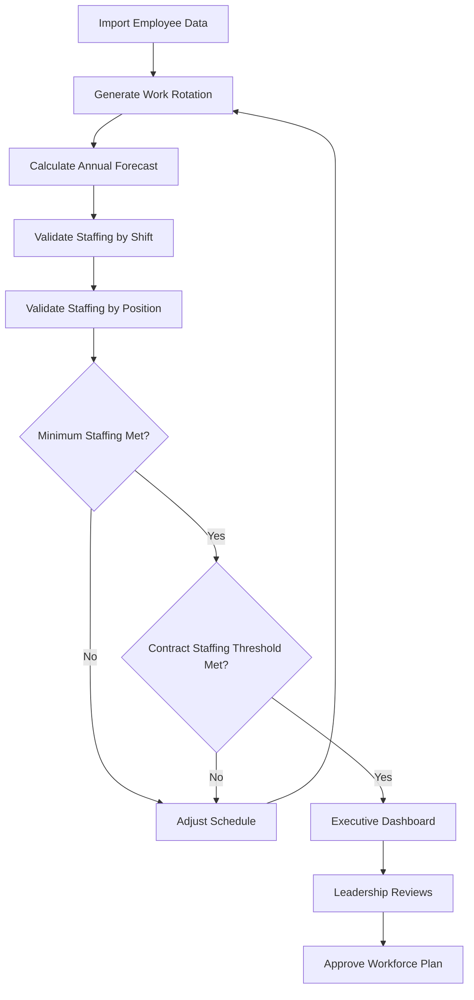
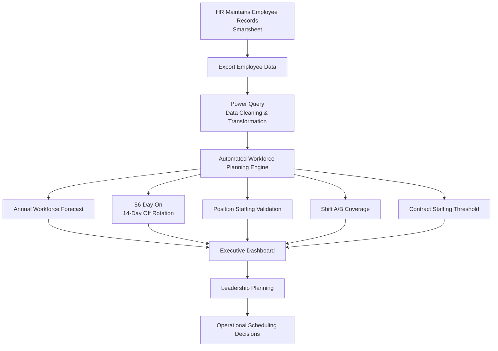
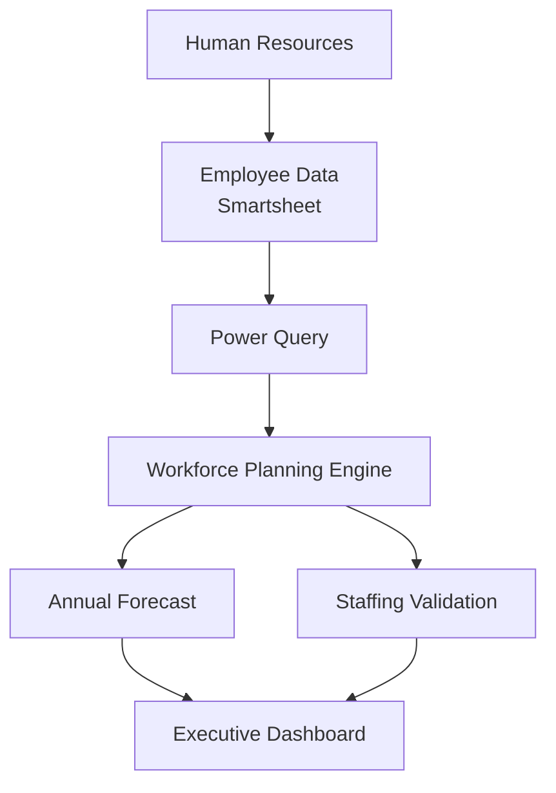

# BA-001 | Workforce Planning & Scheduling System

> Business Analytics Portfolio Series

Designed and implemented an automated workforce scheduling solution that improved operational planning, staffing visibility, and executive reporting for a workforce operating under continuous staffing requirements.

---
# Executive Summary

Designed and implemented a workforce planning and scheduling solution supporting a 350-person operational workforce operating under continuous staffing requirements.

The solution automated workforce scheduling by integrating employee data exported from Smartsheet into a centralized Microsoft Excel platform utilizing Power Query, advanced formulas, and automated forecasting. The system projected employee work rotations, generated annual scheduling forecasts, monitored staffing levels, and ensured contractual staffing requirements were consistently maintained.

By automating workforce planning, leadership gained advance visibility into employee rotations, staffing shortages, position coverage, and billing thresholds months in advance, significantly reducing manual scheduling efforts while improving operational planning and decision-making.

# 📊 Project Snapshot

| Category | Details |
|----------|---------|
| Role | Business Analyst / Solution Designer |
| Industry | Workforce Operations |
| Workforce Supported | 350+ Employees |
| Primary Tools | Excel, Power Query, Power BI |
| Project Type | Process Automation & Operational Reporting |
| Status | Production Implementation |

---

# Business Context

The organization managed approximately 350 operational employees working a 56-day on / 14-day off rotational schedule. Employee demographic information was maintained within Smartsheet by Human Resources, while scheduling activities were performed manually within a separate Excel workbook.

As workforce size increased, manually forecasting employee rotations, maintaining staffing levels, and ensuring contractual staffing obligations became increasingly complex. Leadership required greater visibility into workforce availability while ensuring staffing levels never dropped below required contractual minimums needed to satisfy client billing requirements and operational readiness.

# Business Problem

The existing scheduling process relied on manually exporting employee information from Smartsheet into a large Excel workbook used for workforce scheduling.

This manual process created several operational challenges:

- Annual scheduling forecasts required significant manual effort.
- Workforce rotations were difficult to visualize months in advance.
- Staffing shortages could occur without sufficient visibility.
- Position-level staffing requirements required continuous manual verification.
- Leadership lacked centralized reporting for workforce planning.
- Billing thresholds depended upon maintaining minimum active staffing levels at all times.

---

# Project Objectives

The project was designed to accomplish the following objectives:

- Automate the transfer of workforce data from Smartsheet into Excel.
- Forecast employee work rotations for the entire calendar year.
- Maintain contractual minimum staffing levels.
- Maximize billable workforce hours.
- Provide leadership with advance visibility into workforce availability.
- Monitor staffing coverage by shift and operational position.
- Reduce manual scheduling activities.
- Improve operational reporting and workforce planning.

# Business Rules & Constraints
The Workforce planning system was designed around several operational and contractual requirements.

---

### Operational Rules

- Support a workforce of approximately 350 employees.
- Enforce a 56-day on / 14-day off rotational schedule.
- Forecast workforce availability for the entire calendar year.
- Track staffing coverage by operational shift (A & B).
- Track staffing coverage by operational position.

---

### Contractual Constraints

- Maintain minimum staffing thresholds at all times.
- Maximize billable workforce availability.
- Prevent staffing levels from falling below contractual requirements.
- Support advance planning for employee leave rotations.
- Provide leadership with visibility into future staffing shortages.

---

# Business Decision Logic
The workforce planning engine evaluated each scheduling cycle against operational and contractual requirements before the schedule was considered acceptable.

---

# My Role 

I independently designed, developed, tested, and implemented the workforce scheduling solution from concept through production use.

Responsibilities included:

- Designing the overall workforce scheduling architecture.
- Designed the data integration workflow by transforming employee data exported from Smartsheet into a centralized workforce planning platform using Power Query.
- Developing Power Query transformations.
- Creating advanced Excel calculations supporting workforce forecasting.
- Designing scheduling logic for a 56-day on / 14-day off rotation.
- Building staffing validation tools to maintain contractual staffing requirements.
- Developing operational dashboards and reporting.
- Creating planning tools allowing leadership to forecast workforce availability months in advance.

---

# Solution Workflow

---

# System Architecture

---

# Technologies Used

| Technology | Purpose |
|------------|---------|
| Microsoft Excel | Workforce planning platform and scheduling engine |
| Power Query | Automated data import, transformation, and standardization |
| Advanced Excel Formulas | Workforce forecasting, staffing validation, and scheduling logic |
| Pivot Tables | Workforce reporting and operational summaries |
| Conditional Formatting | Staffing alerts and workforce visibility |
| Smartsheet | Employee demographic data source maintained by Human Resources |

---

# Key Features

- Automated workforce scheduling for approximately 350 employees.
- Forecasted employee work rotations across the entire calendar year.
- Supported a 56-day on / 14-day off rotational staffing model.
- Automated workforce data integration from Smartsheet exports.
- Maintained contractual minimum staffing requirements.
- Maximized billable workforce availability.
- Monitored staffing coverage by operational shift.
- Validated staffing levels by operational position.
- Forecasted employee leave months in advance.
- Improved organizational communication regarding upcoming workforce rotations.
- Produced operational dashboards and executive reporting.
- Reduced manual scheduling effort through workflow automation.

# Business Impact

The Workforce Planning & Scheduling System transformed a manual workforce planning process into a centralized operational planning platform that improved visibility, forecasting, and staffing decision-making.

### Operational Impact

- Supported workforce planning for approximately **350 employees**.
- Enabled leadership to forecast workforce availability across the entire calendar year.
- Automated employee rotation planning using a **56-day on / 14-day off** staffing model.
- Improved staffing visibility by operational shift and position.
- Increased confidence that staffing plans remained above contractual minimum staffing requirements.
- Enhanced communication of upcoming employee leave rotations weeks and months in advance.

---

### Process Improvements

- Eliminated repetitive manual scheduling activities through workflow automation.
- Standardized workforce planning into a repeatable, data-driven process.
- Reduced scheduling errors by applying automated business rules.
- Centralized workforce planning and reporting into a single operational solution.

---

### Leadership Value

- Provided executive dashboards supporting staffing decisions.
- Enabled proactive workforce planning rather than reactive scheduling.
- Improved operational readiness by identifying staffing shortages before they occurred.

---

# Screenshots

The following screenshots demonstrate the production version of the Workforce Planning & Scheduling System.

## Executive Dashboard

---

## Annual Workforce Calendar
*Annual employee rotation schedule supporting the 56-day on / 14-day off staffing model.*
## This table served as the master date dimension for the scheduling engine.
It generated one row for every date in the planning year and calculated:
- Date
- Year
- Month
- Month Name
- Week #
- Week Start (Monday of each week)
- Day Number (1–7)
- Day Name
- Key (used for relationships/merges)
- The purpose wasn't just to make a calendar—it was to give the scheduling engine a consistent date table that every employee's rotation could be compared against.

## The scheduling engine used three main inputs:

## Employee Master Roster
- Employee
- Shift (Alpha / Bravo)
- Position
- Group
- Cycle Start Date (or stagger value)

## Calendar Table
- Every day of the year.

## Business Rule
- 56 days ON
- 14 days OFF
- Total cycle = 70 days

For every employee and every date in the calendar, the workbook determined where that employee was in the 70-day cycle.

---

## Staffing Validation Dashboard
*Validates staffing levels by position and operational shift while ensuring contractual staffing requirements are maintained.*

---

## Scheduling Engine
*Core scheduling workbook responsible for annual forecasting, workforce rotations, staffing validation, and executive reporting.*

---

## Power Query Workflow
*Automated import and transformation of workforce data exported from Smartsheet.*

*(Screenshot coming soon)*

---

# Lessons Learned

Developing this solution reinforced several key Business Analysis principles.

- Clearly defined business requirements simplify solution design.
- Automating repetitive operational processes significantly improves efficiency and consistency.
- Reliable forecasting depends on accurate and standardized source data.
- Building flexibility into the solution allows operational requirements to evolve over time.
- Dashboards should provide decision support rather than simply display information.
- Early stakeholder collaboration increases user adoption and reduces implementation challenges.
- Well-designed automation improves both operational performance and leadership visibility.
---

# Future Enhancements

Future versions of this solution could include:

- Integration directly with enterprise HR systems to eliminate manual exports.
- Migration from Excel to a SQL-backed database for improved scalability.
- Interactive Power BI dashboards with real-time staffing metrics.
- Automated notifications for upcoming employee rotations and leave schedules.
- Predictive staffing models using historical workforce trends.
- Scenario planning tools allowing leadership to model staffing changes before implementation.
- Web-based reporting portal for executives and operational managers.

---
## Portfolio Information

**Project ID:** BA-001

**Portfolio Series:** Business Analytics Portfolio

**Author:** Aaron Dominguez

**Status:** Production Solution

**Repository Version:** 1.0
---

*All business information, screenshots, and datasets have been sanitized to remove confidential or proprietary information while preserving the technical design and business value of the solution.*
